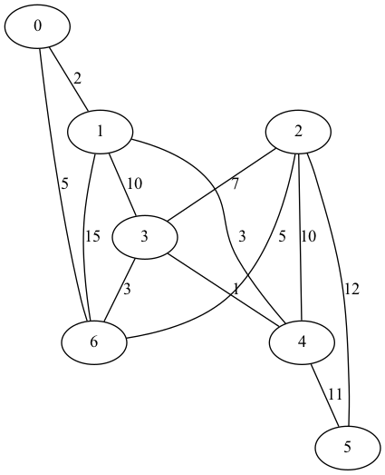
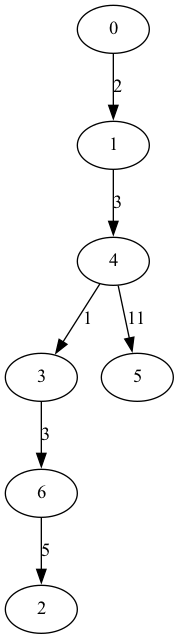

# Introduction 
Ce programme implémente l'algorithme de prim en C qui permet de trouver l'arbre couvrant de plus petit poids d'un graphe valué. Il utilise une matrice d'adjacence valuée, un tableau `valeurs[]` des valeurs minimales pour chaque sommet, un tableau `marque[]` des sommets deja inclus dans l'arbre couvrant, un tableau `parent[]` qui indique à partir de quel sommet un autre sommet a été visité et qui permet finalement de retracer l'arbre couvrant.   

# Utilisation 
Vous pouvez utiliser le makefile pour compiler. Pour cela il suffit d'écrire la commande shell : `make all`

Après avoir exécuter le code au moins une fois et installer graphViz sur votre ordinateur, vous pouvez utiliser les commandes `make vis` et `make tree` pour générer le graphe valué et l'arbre couvant valué du graphe saisi au clavier lors de la dernière exécution du programme. 

Vous pouvez également supprimer les fichiers objets avec le makefile avec la commande : `make clean`

## Graphe valué

## Arbre couvrant valué

